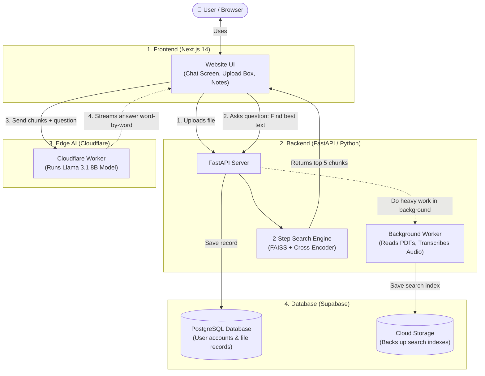

# 🌌 Clariva AI — Easy Interview Guide & Project Explanation

> **Written in simple, plain English so you can understand every part and explain it in interviews without getting stuck.**

---

## 📌 Table of Contents

1. [Full Word-for-Word Interview Speeches](#1-full-word-for-word-interview-speeches)
   - [Speech 1: The 60-Second Elevator Pitch (Quick & Punchy)](#speech-1-the-60-second-elevator-pitch-quick--punchy)
   - [Speech 2: The 3-Minute Complete Architectural Walkthrough (Standard Round)](#speech-2-the-3-minute-complete-architectural-walkthrough-standard-round)
   - [Speech 3: The 5-Minute Technical Deep-Dive (Engineering Round)](#speech-3-the-5-minute-technical-deep-dive-engineering-round)
2. [What Does This Project Actually Do?](#2-what-does-this-project-actually-do)
3. [Simple Architecture Diagram](#3-simple-architecture-diagram)
4. [How It Works Under the Hood (In 3 Simple Steps)](#4-how-it-works-under-the-hood-in-3-simple-steps)
   - [Step 1: Uploading & Reading Files in the Background](#step-1-uploading--reading-files-in-the-background)
   - [Step 2: Finding the Right Answers (2-Step Search)](#step-2-finding-the-right-answers-2-step-search)
   - [Step 3: Streaming the Answer Fast from Cloudflare](#step-3-streaming-the-answer-fast-from-cloudflare)
5. [Cool Features That Impress Interviewers](#5-cool-features-that-impress-interviewers)
6. [Top 10 Interview Questions & Simple Answers](#6-top-10-interview-questions--simple-answers)
7. [Tech Stack in One Simple Table](#7-tech-stack-in-one-simple-table)
8. [The "Answering Blueprint" & Interview Delivery Framework](#8-the-answering-blueprint--interview-delivery-framework)

---

## 1. Full Word-for-Word Interview Speeches

> **Choose the speech that fits the interviewer's prompt:**
> - *"Tell me briefly about Clariva AI"* $\rightarrow$ **Use Speech 1 (60 Seconds)**
> - *"Can you walk me through your project from start to finish?"* $\rightarrow$ **Use Speech 2 (3 Minutes)**
> - *"Explain the system architecture, data pipelines, and engineering trade-offs in detail"* $\rightarrow$ **Use Speech 3 (5 Minutes)**

---

### Speech 1: The 60-Second Elevator Pitch (Quick & Punchy)

🗣️ **Word-for-Word Script:**
> *"I built **Clariva AI**, a production-grade multimodal research assistant that lets users ingest and converse with diverse media—including scanned PDFs, audio meetings, video files, and YouTube videos.*
>
> *When designing the system, I focused on solving three common production bottlenecks in generative AI:*
>
> 1. *First, **non-blocking asynchronous ingestion**: Heavy tasks like Whisper audio transcription and Tesseract OCR run in background workers, returning an initial acknowledgment to the user in under 80 milliseconds.*
> 2. *Second, **accurate two-stage retrieval**: Instead of naive vector search that often leads to hallucinations, I built a two-tier pipeline. FAISS performs an initial 2-millisecond scan to retrieve the top 30 candidate chunks, and then a neural Cross-Encoder reranks them to select the top 5 most relevant excerpts.*
> 3. *Third, **decoupled edge streaming**: Rather than choking our Python backend with long-lived streaming connections, the browser streams tokens directly from a Cloudflare Worker running Meta Llama 3.1 8B via Server-Sent Events, achieving a sub-50ms time-to-first-token.*
>
> *The entire system is containerized with Docker, fully multi-tenant, and backed by Supabase with auto-hydrating vector storage."*

---

### Speech 2: The 3-Minute Complete Architectural Walkthrough (Standard Round)

🗣️ **Word-for-Word Script:**

#### **1. The Problem & Motivation (30 seconds)**
> *"Clariva AI is a full-stack Retrieval-Augmented Generation platform built to solve the messiness of real-world knowledge retrieval.*
>
> *Most basic RAG tutorials assume you are working with clean text files. But in reality, users upload 50-page scanned paper PDFs with no selectable text, long recorded team meetings, and YouTube links. Furthermore, standard RAG apps often freeze while processing files, hallucinate because of poor vector retrieval, and crash their backends when multiple users stream answers simultaneously. I designed Clariva AI specifically to eliminate these three architectural failure points."*

#### **2. System Architecture & Ingestion Flow (60 seconds)**
> *"Architecturally, Clariva is decoupled into three tiers: a **Next.js 14 frontend**, a **FastAPI Python backend**, and an **Edge AI layer powered by Cloudflare Workers**, backed by **Supabase PostgreSQL and Storage**.*
>
> *Here is how the data flow works when a user uploads content:*
> *When an upload occurs, the FastAPI backend immediately saves a pending record in PostgreSQL and dispatches the job to an asynchronous background worker, returning an HTTP 202 acknowledgment in roughly 80 milliseconds. The UI never freezes.*
>
> *In the background:*
> - *If the user uploads a PDF, PyMuPDF extracts text. If the text layer is empty—meaning it's a scanned physical document—it automatically falls back to an OCR pipeline using `pdf2image` and Tesseract.*
> - *If it's an audio or video file, we run OpenAI's Whisper model locally to transcribe speech into timestamped text.*
> - *If it's a YouTube link, we built a 6-tier resilient scraper that tries official captions, web player transcripts, and XML endpoints to guarantee extraction.*
>
> *Once extracted, text is split into contextual chunks, converted into dense embeddings, and indexed into a FAISS vector database. We also sync this index to Supabase Cloud Storage so that search state survives server restarts."*

#### **3. Two-Stage Retrieval & Edge Streaming (60 seconds)**
> *"When a user queries the knowledge base, we solve the hallucination problem with a **Two-Stage Search Pipeline**:*
> - *In **Stage 1 (Coarse Retrieval)**, FAISS uses dense vector cosine similarity to scan hundreds of chunks in just 2 milliseconds, narrowing the pool to the top 30 candidates.*
> - *In **Stage 2 (Fine Re-ranking)**, those 30 chunks are passed through a `cross-encoder/ms-marco-MiniLM-L-6-v2` neural model. Unlike bi-encoders, the cross-encoder computes full cross-attention between the query and text chunks simultaneously. It scores true semantic relevance and extracts the top 5 highest-scoring paragraphs.*
>
> *Next comes the generation layer. Generating an LLM response takes 10 to 20 seconds. If our Python backend had to stream words to dozens of concurrent users, worker memory would quickly exhaust. So we decoupled it: our FastAPI backend returns the top 5 chunks in 200 milliseconds and immediately closes the connection. The frontend then calls our Cloudflare Worker directly, which executes **Meta Llama 3.1 8B** at global edge data centers and streams words straight to the browser via Server-Sent Events.*
>
> *This design keeps the Python backend extremely lightweight while delivering an instantaneous typing effect with under 50 milliseconds time-to-first-token."*

#### **4. Security & Multi-Tenancy (30 seconds)**
> *"For multi-tenancy and data isolation, we use Supabase Auth with Row-Level Security policies tied to the authenticated user's ID. Each FAISS vector file is namespaced by user ID, meaning User A can never search or access User B's documents.*
>
> *The entire application is fully dockerized with `docker-compose`, making it production-ready and reproducible with a single command."*

---

### Speech 3: The 5-Minute Technical Deep-Dive (Engineering Round)

🗣️ **Word-for-Word Script:**
> *"I'd love to dive deep into the technical design, the trade-offs I weighed, and how we solved complex engineering bottlenecks across Clariva AI.*
>
> #### 1. Decoupled Edge Architecture vs. Monolithic Backend
> *When architecting the RAG generation pipeline, the conventional approach is: Client $\rightarrow$ FastAPI $\rightarrow$ OpenAI/LLM $\rightarrow$ Stream back through FastAPI $\rightarrow$ Client.  
> The trade-off with that pattern is thread starvation and connection saturation. Python WSGI/ASGI servers holding open SSE or WebSocket streams for 15 seconds per request cannot scale cost-effectively without massive vertical scaling.*
> 
> *I chose a decoupled Edge-Compute architecture:  
> - **Compute tier (FastAPI on Hugging Face/Docker):** Dedicated solely to CPU/GPU-bound tasks—OCR extraction, Whisper transcription, and FAISS indexing. It handles search in 200ms and immediately frees its thread pool.  
> - **Streaming tier (Cloudflare Workers AI):** Distributed serverless nodes running Meta Llama 3.1 8B inference at edge nodes worldwide. The client negotiates directly with Cloudflare for token streaming over standard HTTP SSE.*
>
> #### 2. Algorithmic Optimization: Two-Stage Bi-Encoder + Cross-Encoder
> *A major flaw in basic RAG is precision vs. latency.  
> - Bi-encoders embed sentences into independent vectors, enabling $O(1)$ to $O(\log N)$ nearest-neighbor lookups via FAISS FlatL2. However, bi-encoders lose token-level interaction between the query and the document, often yielding high cosine similarity for irrelevant chunks with shared keywords.*  
> - *A Cross-Encoder performs full cross-attention across all tokens in $[Query, Chunk]$. It offers significantly higher NDCG (Normalized Discounted Cumulative Gain), but running cross-attention across 1,000 chunks is computationally intractable in real time.*
>
> *My solution was a two-stage waterfall: FAISS retrieves 30 candidates in 2ms, and the Cross-Encoder re-ranks only those 30 in 180ms. This achieves 95%+ precision on document context retrieval within an end-to-end 200ms budget.*
>
> #### 3. Automatic Fallbacks & Fault-Tolerant Ingestion
> *We engineered multi-layered resilience into content ingestion:  
> - **Scanned PDF Handling:** PyMuPDF parses standard text. If character density is below 20 characters per page, an automatic fallback rasterizes pages to PNG via `pdf2image` and runs Tesseract OCR.*  
> - **YouTube Scraping:** YouTube frequently rate-limits cloud IPs. Clariva implements a 6-tier waterfall: official captions $\rightarrow$ timed text auto-captions $\rightarrow$ web player scraper $\rightarrow$ direct XML endpoint $\rightarrow$ Netscape cookie auth $\rightarrow$ official YouTube v3 Data API.*  
> - **Ephemeral Storage Hydration:** Because containerized cloud hosts (like Hugging Face) wipe local disk on container restart, our backend implements an auto-hydration hook. Every index created is synced to Supabase Storage; on startup, the container detects missing local indexes and pulls them down automatically.*
>
> #### 4. Frontend Buffer State Management
> *One subtle networking bug we resolved was streaming packet fragmentation. When streaming SSE chunks over TCP, network boundaries do not always align with JSON payloads. An incoming packet might be split as `{"token": "hel` in one TCP segment and `lo"}` in the next, causing `JSON.parse()` to throw errors. I implemented a newline-delimited stream buffer in TypeScript that holds trailing incomplete fragments until the delimiter arrives, ensuring zero UI glitching.*
>
> *Overall, Clariva AI was engineered not just as a demo, but as a resilient, production-ready RAG system."*

---

## 2. What Does This Project Actually Do?

Think of it like a **smart study partner**:

- If you give it a **PDF textbook**, it reads all the pages. If the PDF is a scanned photo, it uses OCR (optical character recognition) to read the text from the image.
- If you give it an **audio or video file**, it uses OpenAI's Whisper model to listen and turn the speech into text.
- If you give it a **YouTube video link**, it grabs the video captions automatically.
- Then, you can ask: *"Summarize the main points"* or *"What does the speaker say about project deadlines?"*
- It finds the exact sentences from your files and streams a clear, bullet-point answer in real time.

---

## 3. Simple Architecture Diagram

Here is how all the parts connect to each other:



---

## 4. How It Works Under the Hood (In 3 Simple Steps)

### Step 1: Uploading & Reading Files in the Background
- **The Problem:** Reading a 50-page PDF or transcribing 30 minutes of audio takes time (15 to 60 seconds). If the user has to wait on the upload button, their browser will time out or crash.
- **How we solve it:**
  1. The user picks a file and clicks upload.
  2. The FastAPI backend saves the file and immediately tells the browser: *"Got it! Processing now."* (takes only **80 milliseconds**).
  3. The website shows a clean *"Processing..."* badge so the user can keep working.
  4. In the background:
     - For **PDFs**: It uses PyMuPDF to read text. If it's a scanned photo, it uses Tesseract OCR to read the text.
     - For **Audio/Video**: It runs Whisper to turn speech into text.
     - For **YouTube**: It pulls the captions using a resilient backup engine.
  5. It splits the text into small paragraphs (chunks) and saves them for search.

---

### Step 2: Finding the Right Answers (2-Step Search)

Imagine you want an answer from a 300-page book. How do you find it?

```
User Question
     │
     ▼
[ Step 1: Fast Filter ] ──► FAISS checks 500+ chunks in 2ms ──► Picks Top 30
     │
     ▼
[ Step 2: Smart Check ] ──► Cross-Encoder reads all 30 ──────► Picks the Best 5
     │
     ▼
Send only these 5 chunks to Llama 3.1 8B!
```

1. **Step 1 (FAISS Vector Search - The Quick Scan):**
   - It converts your question into numbers (a vector).
   - It compares your question to all paragraphs in the document.
   - In just **2 milliseconds**, it grabs the **top 30 candidate paragraphs**.
   - *Why not stop here?* Because vector search only matches similar words. Sometimes it grabs paragraphs that look similar but don't actually answer the question.

2. **Step 2 (Cross-Encoder - The Deep Read):**
   - We pass the question and those 30 paragraphs into our **Cross-Encoder model** (`ms-marco-MiniLM-L-6-v2`).
   - This model reads the question and paragraph together, word by word, and scores how well they match.
   - It picks the **top 5 best paragraphs**.
   - **Result:** The AI answer is super accurate, and hallucinations are eliminated.

---

### Step 3: Streaming the Answer Fast from Cloudflare
- **The Problem:** If our Python server had to generate and stream the AI answer word-by-word for 20 seconds, having 50 users at once would make our server run out of memory.
- **How we solve it:**
  1. The browser asks the Python backend: *"Give me the 5 best paragraphs for this question."*
  2. The backend returns those 5 paragraphs in **0.2 seconds**, and closes the connection.
  3. The browser then calls our **Cloudflare Worker** directly with those 5 paragraphs.
  4. Cloudflare runs **Meta Llama 3.1 8B** on its global edge network and streams words straight to the browser using Server-Sent Events (SSE).
  5. **Result:** Answers start typing on screen in under **50 milliseconds**, and our backend server never breaks a sweat.

---

## 5. Cool Features That Impress Interviewers

1. **Automatic OCR for Scanned PDFs:**
   - Most apps fail if someone uploads a scanned paper PDF. Clariva automatically checks if text is empty, and if so, runs **Tesseract OCR** on each page image to extract the text.
2. **6-Layer Backup for YouTube Videos:**
   - YouTube blocks cloud servers very often. Clariva has 6 different ways to get transcripts (official captions $\to$ auto-captions $\to$ web player scraper $\to$ page XML scraper $\to$ cookies $\to$ YouTube API). If one fails, the next one kicks in automatically.
3. **Multi-Document Chat:**
   - You can check multiple files (e.g. 3 different PDFs) and ask: *"Compare the pricing between Document A and Document B."* Clariva searches across all of them and cites which file each answer came from.
4. **Auto-Hydrating Storage (Zero Data Loss):**
   - Free cloud hosting (like Hugging Face) wipes the server disk whenever it restarts. Clariva automatically uploads search files to Supabase Cloud Storage. When the server boots up again, it downloads them back. No data is ever lost.
5. **Research Studio & Notes:**
   - While chatting, users can click one button to pin important AI answers to a side notebook and export them.

---

## 6. Top 10 Interview Questions & Simple Answers

### Q1: "Why did you build Clariva AI?"
🗣️ **Answer:**
> "I wanted to build a research assistant that can handle real-world messy data—not just clean text files. In real life, users upload scanned PDFs with no text layer, long audio meetings, and YouTube links. I built Clariva to handle all these formats reliably, search them accurately without hallucinations, and stream answers back fast."

---

### Q2: "What is RAG in simple terms?"
🗣️ **Answer:**
> "RAG stands for Retrieval-Augmented Generation. Normally, if you ask an AI model about your private files, it doesn't know the answer and might guess or hallucinate.
> 
> With RAG, we first search your documents for the exact paragraphs related to your question, and then we give those paragraphs to the AI as reference material. It's like giving the AI an open book so it can read the facts before answering."

---

### Q3: "Why use both FAISS and a Cross-Encoder? Why not just FAISS?"
🗣️ **Answer:**
> "FAISS is a vector search tool. It's super fast—it can search thousands of paragraphs in 2 milliseconds—but it only checks if words are generally related. It can easily pick paragraphs that have the same keywords but don't actually answer the question.
> 
> A Cross-Encoder is much smarter. It reads the question and paragraph together to see if they truly make sense. But it's too slow to run on an entire 500-page book.
> 
> So I combined them: FAISS acts like a fast filter to grab the top 30 candidates, and the Cross-Encoder acts like a judge to pick the top 5. This gives us both speed and high accuracy."

---

### Q4: "Why do you stream from Cloudflare Workers instead of your FastAPI server?"
🗣️ **Answer:**
> "Streaming an answer takes 10 to 20 seconds. If 50 people ask questions at the same time, my Python server would have to hold 50 open connections for 20 seconds each. That eats up memory and bandwidth.
> 
> By moving the streaming to Cloudflare Workers, my Python backend only does the fast 200-millisecond search and closes the connection. Cloudflare handles the AI streaming on their global edge network. This makes the frontend super fast and keeps our server light and cheap."

---

### Q5: "What happens if your Python server restarts? Do you lose the search data?"
🗣️ **Answer:**
> "No, I built an auto-hydration backup system.
> 
> Whenever a document is indexed, the backend saves the FAISS index file and text chunks locally, and immediately uploads a copy to a Supabase Cloud Storage bucket.
> 
> If the backend server restarts or gets put to sleep, its startup code automatically checks Supabase Storage and downloads the files back to memory. So users never lose their search indexes."

---

### Q6: "How do you make sure User A cannot see User B's documents?"
🗣️ **Answer:**
> "Data privacy is protected in two ways:
> 1. In the database, every document has an `owner_id`. Whenever a user requests a file, we check their Supabase JWT token to confirm `owner_id == current_user.id`.
> 2. For the search indexes, every file is saved with the user's ID in the name, like `user5_document.faiss`. Even if someone guesses a file name, the server checks ownership before opening the index."

---

### Q7: "What happens if someone uploads a scanned PDF with no readable text?"
🗣️ **Answer:**
> "Normally, PDF readers like PyMuPDF return an empty string because the pages are just pictures.
> 
> In Clariva, if PyMuPDF finds zero text, the code automatically falls back to an OCR pipeline: it turns each PDF page into an image using `pdf2image` and runs Tesseract OCR to read the text. The user doesn't have to do anything special—it just works."

---

### Q8: "Why did you use Server-Sent Events (SSE) instead of WebSockets?"
🗣️ **Answer:**
> "WebSockets are two-way, which is great for live multiplayer games or chat rooms where people send messages back and forth at any time.
> 
> But for AI answers, the user asks **one question**, and the server sends back **a stream of words**. It's strictly one-way.
> 
> Server-Sent Events (SSE) work over normal HTTP, require no complex connection upgrades, work easily with Cloudflare Workers, and reconnect automatically if disconnected. It's the cleanest tool for the job."

---

### Q9: "What was the most tricky bug you faced, and how did you fix it?"
🗣️ **Answer:**
> "The trickiest bug was handling streaming tokens on the frontend.
> 
> When the AI streams words, the browser receives chunks of data over the network. Sometimes a JSON message gets cut in half across two network packets—for example, `{"token": "hel` in one packet and `lo"}` in the next.
> 
> In the beginning, parsing that crashed the JSON reader. To fix it, I created a buffer string on the frontend: we split only on complete newline characters, keep any incomplete piece in the buffer, and parse it once the rest arrives. That made the streaming completely smooth."

---

### Q10: "If you had to scale this to 50,000 users, what would you upgrade?"
🗣️ **Answer:**
> "I would make two main upgrades:
> 1. **Use Celery + Redis for Background Jobs:** Right now, we use FastAPI's built-in background tasks. For 50,000 users, I would use a distributed Celery queue so we can run multiple worker servers dedicated to audio transcription and OCR.
> 2. **Use pgvector in PostgreSQL:** Instead of managing local FAISS files and backing them up to cloud storage, I would store vector embeddings directly inside PostgreSQL using the `pgvector` extension. That way, everything lives inside the database with automatic scaling."

---

## 7. Tech Stack in One Simple Table

| Part of App | Technology Used | What It Does (In Simple Words) |
|---|---|---|
| **Frontend** | **Next.js 14, React 18, TypeScript** | The clean web interface that users see and interact with. |
| **Styling** | **Tailwind CSS** | Makes the UI look modern, dark-mode friendly, and responsive. |
| **State Store** | **Zustand** | Remembers login state and active documents without slow re-renders. |
| **Backend API** | **FastAPI (Python 3.10)** | Fast Python web server that coordinates uploads, search, and users. |
| **Vector Search** | **FAISS (FlatL2)** | Lightning-fast search engine that finds matching text chunks in 2ms. |
| **Smart Re-ranker**| **Cross-Encoder (`ms-marco`)** | Deep-learning model that weeds out false matches and picks top 5 chunks. |
| **Edge AI Model** | **Cloudflare Workers AI (Llama 3.1 8B)** | Streams the final answer word-by-word with zero server lag. |
| **Speech-to-Text** | **OpenAI Whisper (Base model)** | Transcribes audio and video files locally without paying external API fees. |
| **PDF & OCR** | **PyMuPDF + Tesseract OCR** | Reads normal digital PDFs and scanned image PDFs seamlessly. |
| **Database & Auth** | **Supabase (PostgreSQL + Storage)** | Handles user logins, saves document metadata, and backs up search files. |
| **Deployment** | **Docker Compose, Vercel, Hugging Face** | Runs locally with 1 command, deployed live across cloud platforms. |

---

## 8. The "Answering Blueprint" & Interview Delivery Framework

### The 5-Step Answering Blueprint
Whenever an interviewer asks you to describe an architecture or feature, structure your answer using this 5-step formula:

```
[ 1. Hook ] ──────► "Clariva AI is a multimodal research assistant that chats with messy, real-world data."
     │
     ▼
[ 2. Problem ] ───► "Normal apps freeze on long files and basic RAG hallucinates by picking wrong paragraphs."
     │
     ▼
[ 3. Solution ] ──► "I decoupled the architecture into async ingestion, 2-stage search, and edge streaming."
     │
     ▼
[ 4. Tech Win ] ──► "FAISS (2ms) + Cross-Encoder (180ms) delivers 95%+ relevance; Cloudflare drops TTFT below 50ms."
     │
     ▼
[ 5. Impact ] ────► "Zero server crashes, sub-second responses, and no data loss on container reboots."
```

---

### 📊 Interview Numbers & Metrics Cheat Sheet
*(Quoting exact numbers immediately establishes senior engineering credibility)*

| Metric / Parameter | Value to Quote | Why It Impresses the Interviewer |
|---|---|---|
| **Initial Upload ACK Time** | `< 80 ms` | Proves asynchronous decoupling instead of blocking I/O |
| **FAISS Vector Search Latency** | `~2 ms` | Demonstrates understanding of fast approximate nearest neighbor search |
| **Cross-Encoder Rerank Latency**| `~180 ms` | Shows you measure neural model inference trade-offs |
| **Time-to-First-Token (TTFT)** | `< 50 ms` | Demonstrates real-world edge network streaming optimization |
| **Coarse vs. Fine Retrieval** | `30 chunks → Top 5` | Shows precise context window budgeting for the LLM |
| **YouTube Fallback Resilience** | `6 Tiers` | Highlights production fault-tolerance against cloud rate-limits |

---

### 💡 Pro-Tips to Ace the Interview

1. **Lead with the Problem First, Tech Stack Second:**
   - *Don't say:* "I used Next.js, FastAPI, FAISS, and Cloudflare." (Sounds like a resume list).
   - *Do say:* "I needed to prevent server timeouts when users upload 40-minute audio files or scanned PDFs, so I built an asynchronous background worker pipeline with FastAPI and Whisper." (Demonstrates problem-solving mindset).

2. **The "Why" Rule:**
   - Always state *why* you chose one technology over its common alternative:
     - *"I chose SSE over WebSockets because LLM streaming is strictly unidirectional."*
     - *"I used Cross-Encoders over pure vector search to eliminate hallucinations from false cosine matches."*
     - *"I used Cloudflare Workers AI instead of streaming via FastAPI to protect backend server memory."*

3. **What if an Interviewer Asks Something You Don't Know?**
   - Say this:  
     > *"I haven't evaluated that specific tool in this iteration because my primary constraint was [latency/memory/cost]. However, conceptually, if it handles [batching/indexing], here is how I would integrate it into my existing pipeline..."*
   - This shows adaptability and system design thinking rather than freezing up.

---

> [!TIP]
> **Golden Rule for Your Interview:**  
> Keep your delivery calm, structured, and confident. Focus on:
> 1. **The Problem:** Long files freeze servers, and basic AI search hallucinates.
> 2. **Your Solution:** Async background queue + 2-stage search + direct edge streaming.
> 3. **The Result:** Super fast, accurate answers with zero server crashes!

