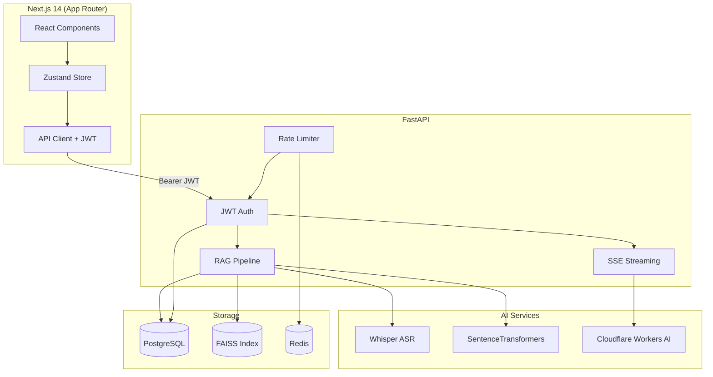

# Clariva AI

An open-source, AI-powered knowledge base and research assistant.

Feed Clariva a YouTube video, PDF document, or website URL. It ingests the content, builds a vector index, and lets you ask questions with AI-generated answers that cite their source.

---

## Architecture



## Features

- [x] YouTube video ingestion (Whisper transcription)
- [x] PDF document ingestion (PyMuPDF)
- [x] Website content extraction (Trafilatura)
- [x] RAG-powered Q&A with FAISS vector search
- [x] SSE streaming chat responses (word-by-word)
- [x] Multi-source chat (query across all sources)
- [x] JWT authentication (access + refresh tokens)
- [x] Answer feedback (thumbs up/down with accuracy stats)
- [x] Auto-generated source summaries
- [x] Command palette (Ctrl+K source search)
- [x] Conversation export as Markdown
- [x] Rate limiting (slowapi + Redis)
- [x] Dark/light mode
- [x] Docker Compose deployment

## Tech Stack

| Layer | Technology |
|-------|-----------|
| Frontend | Next.js 14, React 18, TypeScript, Tailwind CSS |
| State | Zustand |
| Animations | Framer Motion |
| Backend | FastAPI, Python 3.11 |
| Auth | JWT (python-jose), bcrypt (passlib) |
| Embeddings | SentenceTransformers (all-MiniLM-L6-v2) |
| Vector Store | FAISS |
| LLM | Cloudflare Workers AI |
| ASR | OpenAI Whisper (base) |
| Database | PostgreSQL (prod) / SQLite (dev) |
| Rate Limiting | slowapi + Redis |
| Container | Docker Compose |

## Local Setup

### Docker (recommended)

```bash
cp .env.example .env
# Edit .env with your secrets
docker compose up --build
```

The app will be available at:
- Frontend: http://localhost:3000
- API docs: http://localhost:8000/docs

### Manual

**Backend:**

```bash
cd backend
python -m venv acpenv
source acpenv/bin/activate  # Windows: acpenv\Scripts\activate
pip install -r requirements.txt
uvicorn main:app --reload
```

**Frontend:**

```bash
cd frontend
npm install
npm run dev
```

## Design Decisions

### Why FAISS over Qdrant?

FAISS runs entirely in-process with zero infrastructure overhead. For a single-user or small-team knowledge base where the index fits in memory, FAISS provides sub-millisecond search without needing a separate vector database service. If the project scales to millions of documents or needs distributed search, migrating to Qdrant or Pinecone would be straightforward since the embedding layer is decoupled.

### Why Whisper base?

The `base` model (74M parameters) offers the best trade-off between transcription accuracy and speed for a self-hosted application. It runs on CPU in ~1x real-time, which is acceptable for on-demand video ingestion. The `small` or `medium` models provide marginal accuracy gains but require significantly more compute and memory.

### Why Cloudflare Workers for LLM?

Cloudflare Workers AI provides free-tier access to open-source LLMs (Llama, Mistral) with edge deployment, eliminating the need for GPU infrastructure or expensive API keys. The worker acts as a thin proxy, making it easy to swap the underlying model or switch to OpenAI/Anthropic by changing a single URL.

## Screenshots

| Auth | Dashboard | Chat |
|------|-----------|------|
|  |  |  |

---

Built with care by [Pritam Kundu](https://github.com/Pritam16345).
